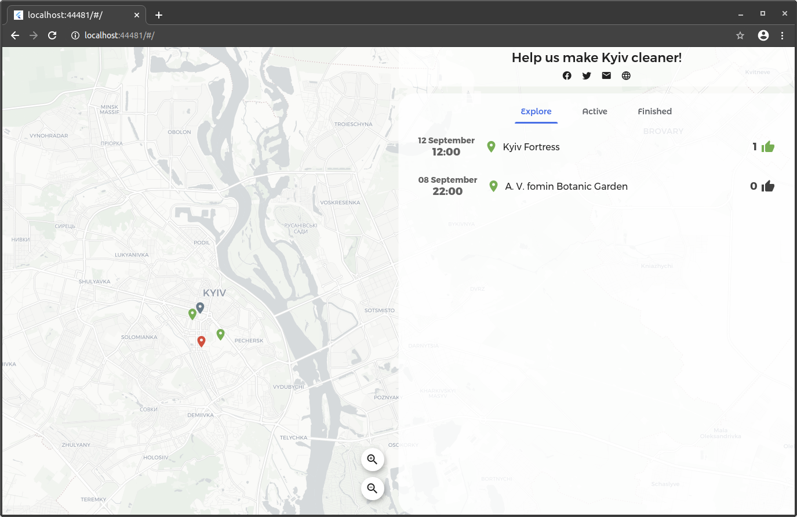
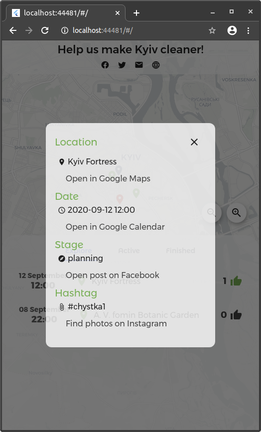

## Chystka: Project for Flutter Hack 20
For a lot of countries pollution is still a big issue. We don't want to live in the untidy environment.  But sometimes it's very tough to engage people into cleaning massively, that's why this app was created.

Ideally, an instance of this app is hosted and maintained by volunteers and leaders of the city or neighborhood. The ones in charge examine local areas and add new events for cleaning. People who want to help their city be cleaner, visit the website, and select the event suitable for them.

**demo: [marchello.cf/chystka](https://marchello.cf/chystka)**


### Screenshots
[YouTube demo](https://www.youtube.com/watch?v=OsDl0AqCzEs&feature=youtu.be)

Web | Mobile
------------ | -------------
 | 


### Docs

Project structure:
```
.
├── chystka                  # flutter application
│   └── lib
│       ├── components       # ui components
│       ├── models           # app models
│       └── model_views      # reusable ui components for models
└── server                   # server (aqueduct)
    └── bin
```

Before running server part on linux, make sure you have installed sqlite:

`sudo apt-get -y install sqlite3 libsqlite3-dev`

Windows and Darwin should be fine

After running the server, edit `chystka/lib/conf.dart` accordingly.

If you want to add/edit events, use sqlite editor, your database file: `server/.dart-tool/sqflite_common_ffi/databases/data.db`. Sorry for the inconvenience.

_TODO: Admin panel for managing events_
